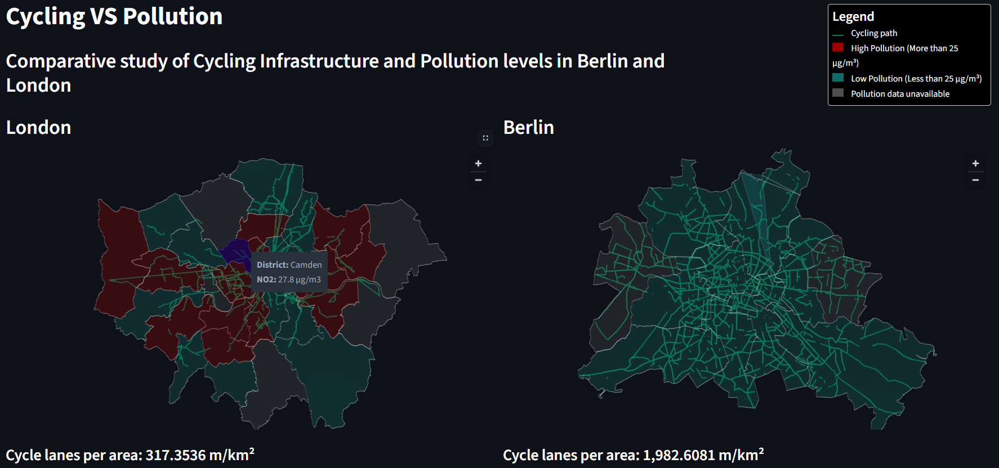

# Cycling VS Pollution

A visual comparative geospatial analysis of cycling infrastructure density and its relationship to pollution levels in Berlin and London



# Running the application

### Environment setup

  ```
  python pip install requirements.txt
  ```

### PostgreSQL database creation

  1. Create a database in your local PostgreSQL Server with PgAdmin4 (for more information refer to the [PostgreSQL Documentation](https://www.postgresql.org/docs/)
  
  2. Install **PostGis** and **PostGis raster** extensions (for more information refer to the  [PostGis Documentation](https://postgis.net/documentation/))

  3. Add the correct dependencies to "_engine_url" in [engine.py](engine.py) as such

  ```
  _engine_url = URL.create(drivername='postgresql',
                           username=<your username>,
                           password=<your password>,
                           host=<host>,
                           port=<port>,
                           database=<name of database where you want your data to be stored>)
  ```

  (all needed data can be found in PgAdmin4 -> right click on the server dropdown (usually PostgreSQL <version>) -> Connection)

  4. in [db_utils.py](db_utils.py) run
  ```
      createDB()
  ```
### Running the code
Run the following command in your terminal

  ```
  streamlit run app.py
  ```

# Data Disclaimer
This project uses publicly available data from the following official sources:

Transport for London (TfL)
Data obtained from the [TfL Open Data Portal](https://tfl.gov.uk/info-for/open-data-users/)

Greater London Authority (GLA)
Data accessed via the [London Datastore](https://data.london.gov.uk/)

Berlin Senate Department for Mobility, Transport, Climate Protection and the Environment
Data retrieved from the [Berlin Open Data Portal](https://daten.berlin.de/)

The original data remain the property of their respective providers. The versions included here have been cleaned, processed, and reformatted for the purposes of this project. This repository does not claim ownership of the original data. Users seeking authoritative or updated versions of the datasets should consult the respective official data portals.
